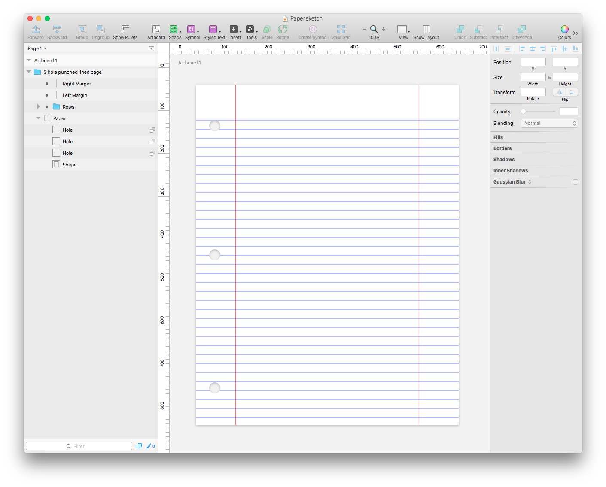

3 Hole Punched Paper in Sketch format
=========================================

Vector based paper with 3 hole punch in Sketch file format.

Created by [Jay Holtslander](http://jay.holtslander.com) as part of his library of [Components for Sketch](https://github.com/JayHoltslander/Components-for-Sketch)

[Test](../../../../)

About Sketch
------------

[Sketch](http://bohemiancoding.com/sketch/) is a newish graphics editing app for Mac that is quickly growing in popularity as an alternative to Photoshop. 

License
------------
[WTFPL](http://www.wtfpl.net/)
