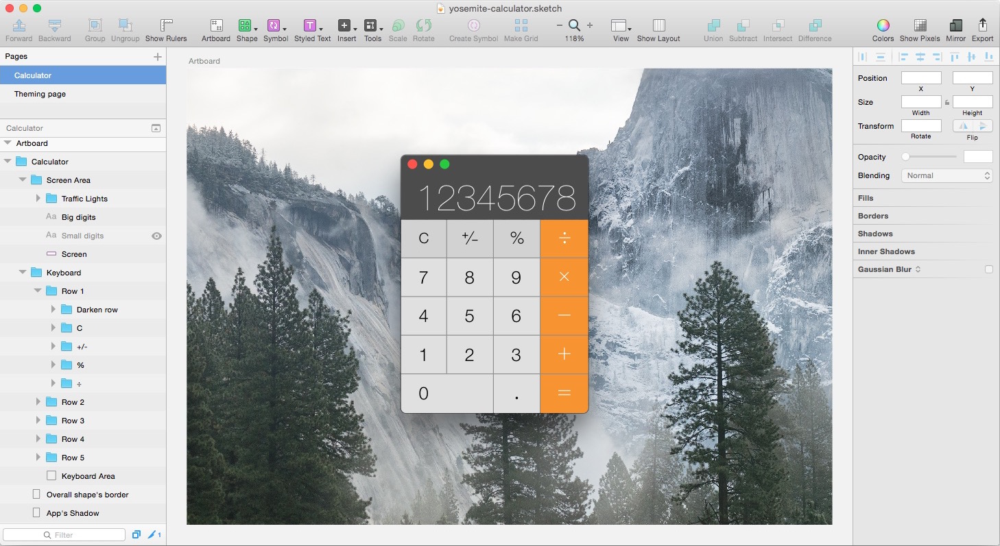
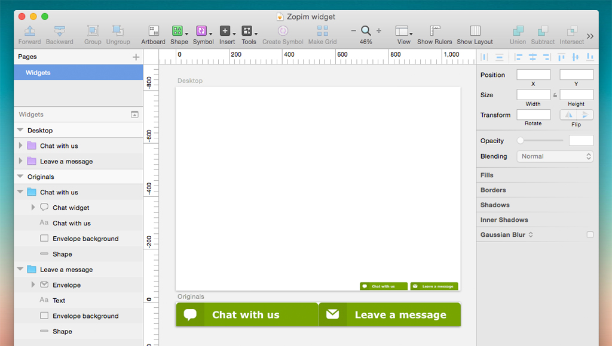
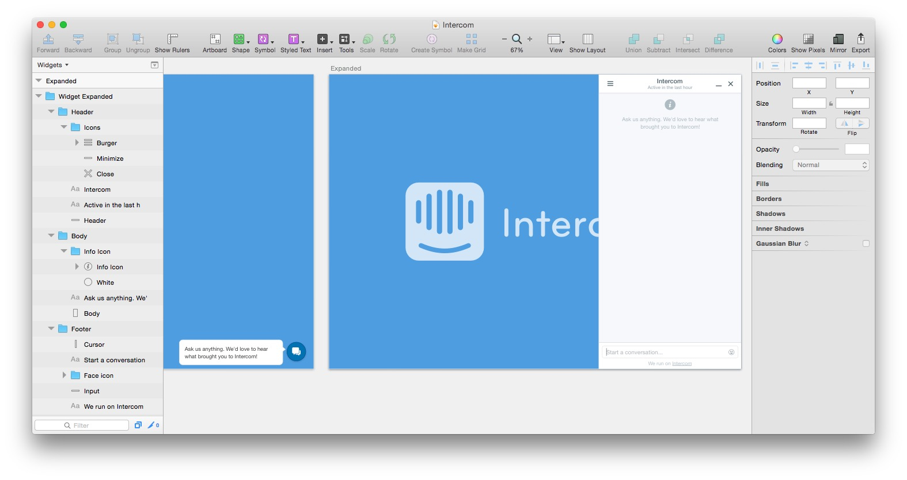
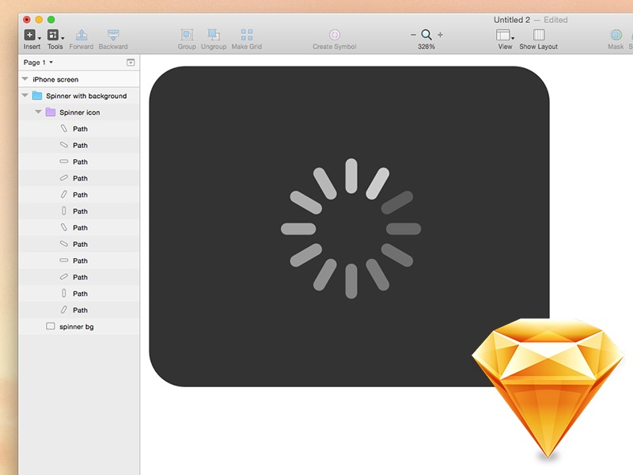
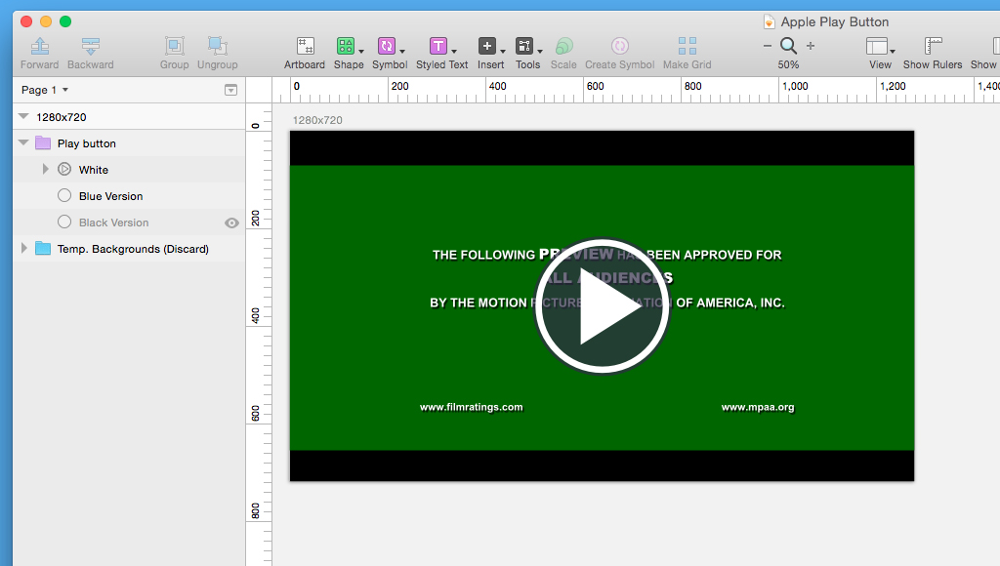
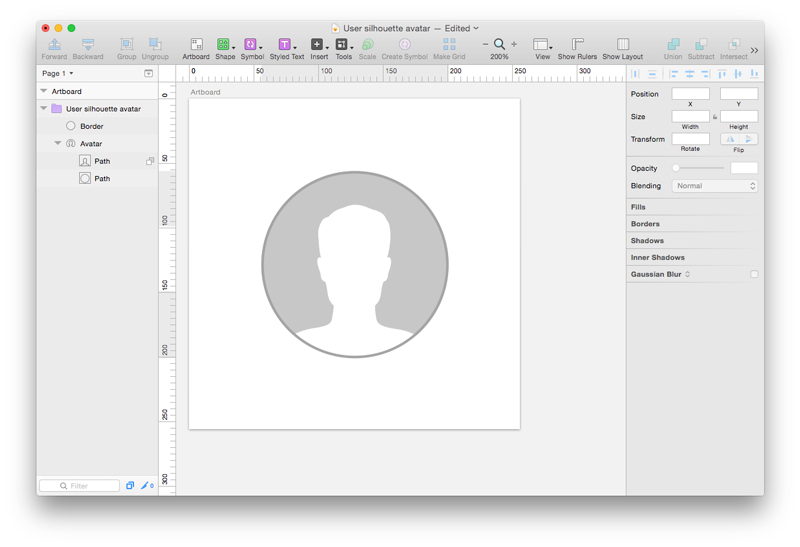
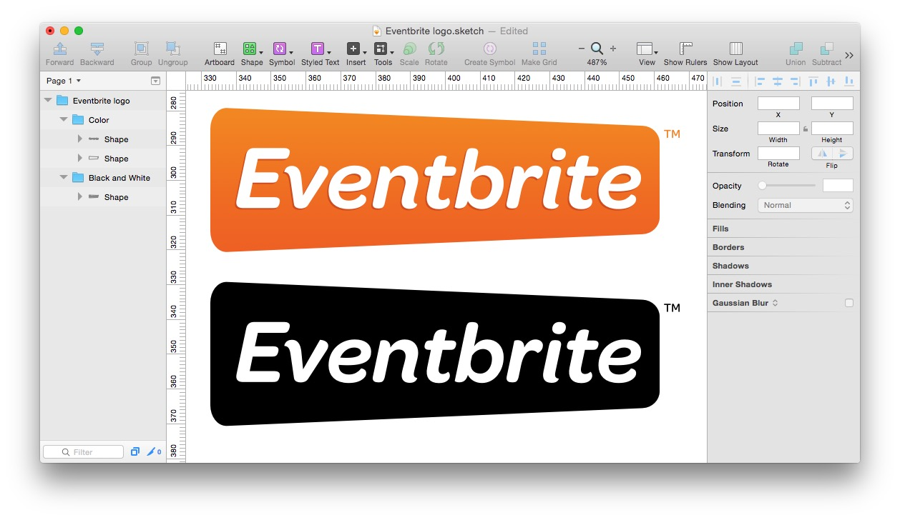
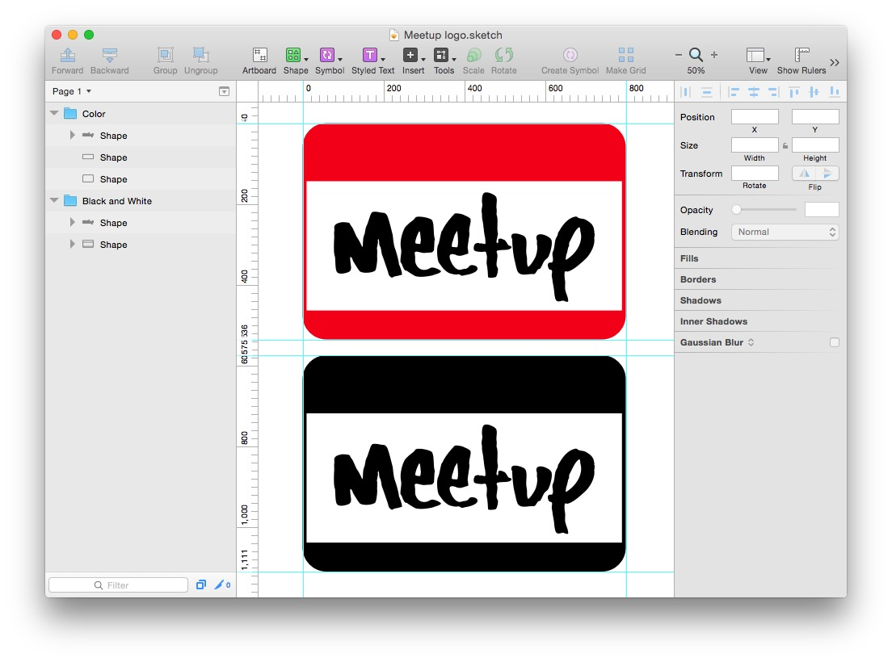
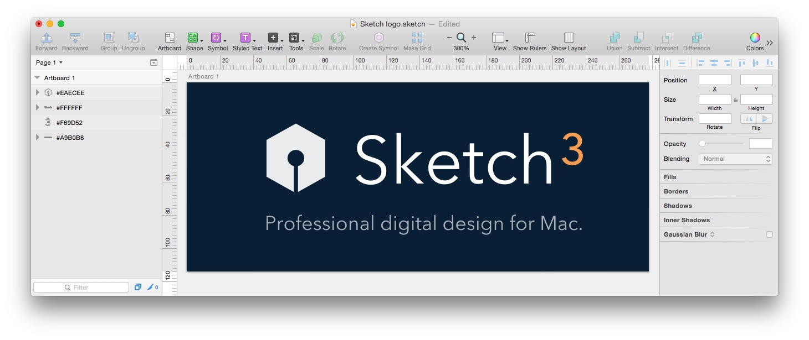
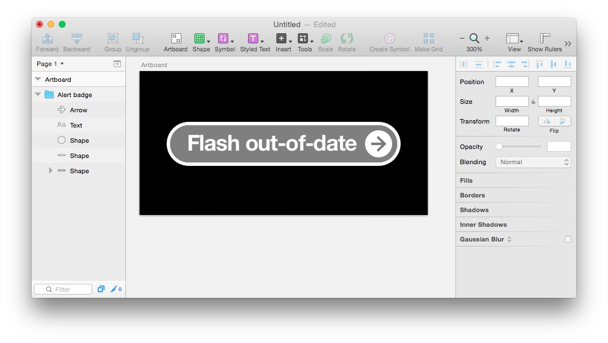

# Components-for-Sketch

A collection of Sketch files I've constructed for use in various projects. More coming soon and on a regular basis.

About Sketch
------------
[Sketch](http://bohemiancoding.com/sketch/) is a newish graphics editing app for Mac that is quickly growing in popularity as an alternative to Photoshop. 

License
------------
[WTFPL](http://www.wtfpl.net/)

##Currently includes:

###[Yosemite Calculator](https://github.com/JayHoltslander/Components-for-Sketch/tree/master/Yosemite-Calculator)

###[Zopim Chat widget](https://github.com/JayHoltslander/Components-for-Sketch/tree/master/Zopim-Chat-Widget)

###[Intercom Chat widget](https://github.com/JayHoltslander/Components-for-Sketch/tree/master/Intercom-Chat-Widget)

###[iOS Spinner](https://github.com/JayHoltslander/Components-for-Sketch/tree/master/iOS-Spinner)

###[Apple'esque Play Button](https://github.com/JayHoltslander/Components-for-Sketch/tree/master/Apple-Play-Button)

###[Apple'esque User Silhouette Avatar](https://github.com/JayHoltslander/Components-for-Sketch/tree/master/User-Silhouette-Avatar)

###[Eventbrite Logo](https://github.com/JayHoltslander/Components-for-Sketch/tree/master/Logos/Eventbrite-logo)

###[Meetup.com Logo](https://github.com/JayHoltslander/Components-for-Sketch/tree/master/Logos/Meetup-logo)

###[Sketch Logo](https://github.com/JayHoltslander/Components-for-Sketch/tree/master/Logos/Sketch-logo)

###[Apple'esque Alert Badge](https://github.com/JayHoltslander/Components-for-Sketch/tree/master/Apple-Alert-Badge)

