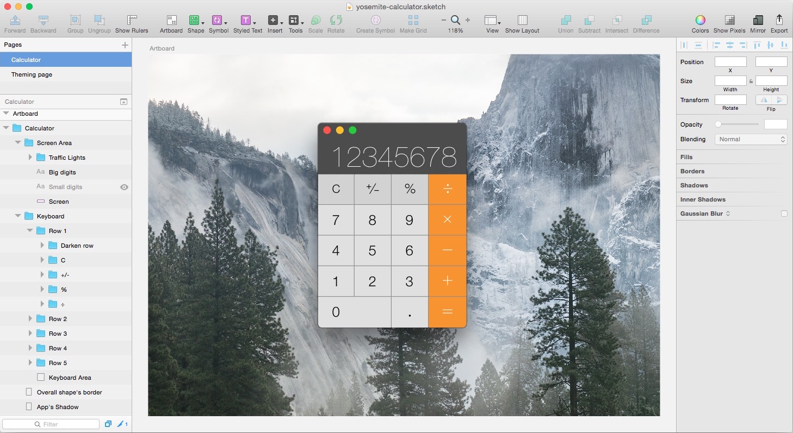

Yosemite Calculator in Sketch format
=========================================

Vector based Calculator in Sketch file format. A **pixel perfect** recreation of the Apple OSX Yosemite Calculator.

Created by [Jay Holtslander](http://jay.holtslander.com) as part of his library of [Components for Sketch](https://github.com/JayHoltslander/Components-for-Sketch)

 

About Sketch
------------

[Sketch](http://bohemiancoding.com/sketch/) is a newish graphics editing app for Mac that is quickly growing in popularity as an alternative to Photoshop. 

License
------------
[WTFPL](http://www.wtfpl.net/)
